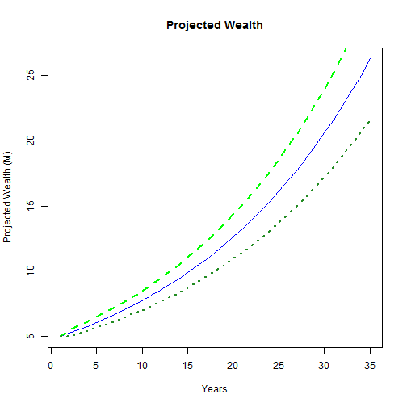

## Wealth Projection

We present a simple projection used for financial planning.

Based on the level of risk that you are willing to take and the level of returns that you are expecting, a prediction of your future wealth can be made. 

--- .class #id 

## Calculating the expected wealth

The expected wealth can be computed from the initial wealth and the expected returns.

Obviously, the higher the expected returns, the faster the wealth will grow.

 

---- .class #id

## Using the Risk

With higher risks, there will be a greater variability in the actual wealth that is accumulated.

The higher the risks, the greater the spread between the upper and lower lines.

 

---- .class #id

## Putting it together

The graph gives you some sense of how risk and return are related to each other.

However, you will need to assess whether the expected returns and desired risks are appropriate in the current investment climate.

 
